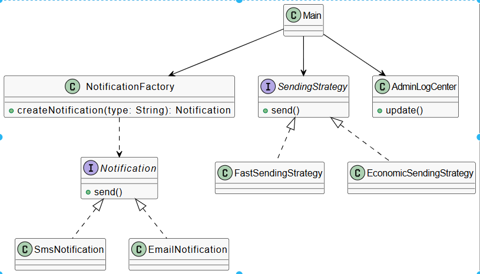

# Phase 2: Behavioral Patterns (Strategy & Observer)

Bu fazda, sistemin davranışsal esnekliğini artırmak ve bileşenler arası bağımlılığı (coupling) azaltmak amacıyla iki temel örüntü uygulanmıştır.

### 1. Strategy Pattern (Strateji Örüntüsü)
* **Nerede Uygulandı:** Bildirim gönderim sürecinde (`FastSendingStrategy` ve `EconomicSendingStrategy`).
* **Neden:** Bildirimlerin gönderim hızını ve maliyetini belirleyen algoritmaları, ana sınıflardan (Notification sınıfları) ayırmak için seçilmiştir.
* **Ne Kazandık:** - **Esneklik:** Çalışma zamanında (runtime) gönderim stratejisi değiştirilebilir hale geldi.
  **Genişletilebilirlik:** Yeni bir gönderim modu eklendiğinde mevcut kodları bozmadan sadece yeni bir strateji sınıfı eklemek yeterli oldu.

### 2. Observer Pattern (Gözlemci Örüntüsü)
* **Nerede Uygulandı:** `AdminLogCenter` ve bildirim gönderim takip mekanizmasında.
* **Neden:** Sistemde gerçekleşen önemli olaylardan (bildirim gönderimi vb.) log merkezinin otomatik olarak haberdar olmasını sağlamak için uygulandı.
* **Ne Kazandık:** - **Gevşek Bağlılık (Loose Coupling):** Sistem, log merkezinin iç detaylarını bilmek zorunda kalmadan sadece olayları yayınlar.
    - **Otomasyon:** Manuel loglama yerine olay tabanlı otomatik bir takip sistemi kuruldu.

---
###  Mimari Diyagram Güncellemesi (Phase-2)

1. Problem
Başlangıçta NotificationService sınıfı, hangi bildirim türünün (SMS, Email) oluşturulacağına if-else blokları kullanarak kendisi karar veriyordu. Bu durum, sisteme yeni bir bildirim türü eklendiğinde servis kodunun sürekli değiştirilmesini gerektiriyordu (Open-Closed prensibine aykırı). Nesne oluşturma mantığı ile iş mantığı birbirine karışmıştı.

2. Çözüm
Nesne oluşturma sorumluluğu NotificationService üzerinden alınarak NotificationFactory sınıfına devredildi. Servis artık somut sınıfları (SmsNotification, EmailNotification) tanımak yerine sadece Notification arayüzünü ve fabrikayı tanıyor.

3. Kazanımlar
Esneklik: Yeni bir bildirim türü eklemek için mevcut servis koduna dokunmaya gerek kalmadı.
Bakım Kolaylığı: Nesne oluşturma mantığı tek bir merkezde toplandı.
Gevşek Bağlılık (Loose Coupling): Sınıflar arası bağımlılık azaltıldı.
