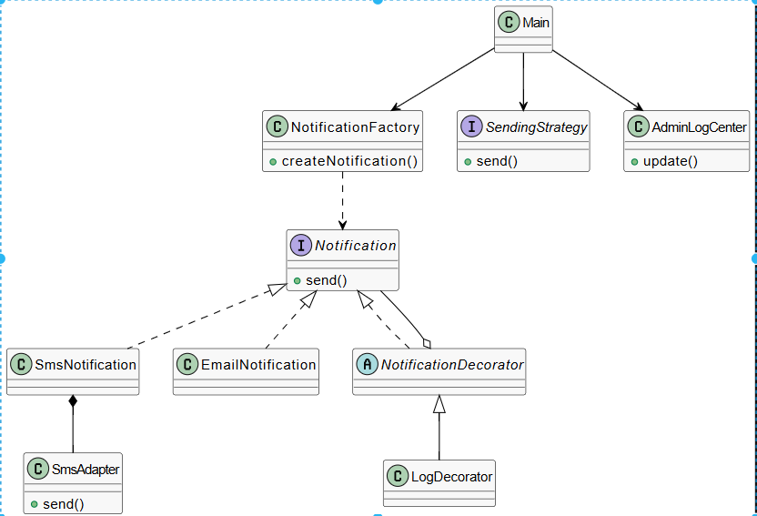

# Bildirim Sistemi Projesi (Notification System)

Bu proje, bir bildirim sisteminin yazılım tasarım desenleri (Design Patterns) kullanılarak geliştirilmiş halidir. Sistem; SMS ve Email gibi farklı kanallar üzerinden, esnek ve genişletilebilir bir mimariyle bildirim gönderimi sağlar.

## 🚀 Proje Ne Yapıyor?
Uygulama, kullanıcıların ihtiyacına göre dinamik olarak bildirim nesneleri üretir. Gönderim sürecinde farklı hız/maliyet stratejileri seçilmesine olanak tanır, tüm gönderim sürecini bir log merkezi üzerinden takip eder ve dış kütüphanelerin sisteme entegre edilmesini sağlar.

## 🛠️ Kullanılan Tasarım Örüntüleri
Proje kapsamında 3 fazda aşağıdaki desenler uygulanmıştır:

* **Factory Method:** Bildirim nesnelerinin (SMS/Email) somut sınıflarını istemciden gizleyerek nesne üretimini merkezileştirir.
* **Strategy:** Bildirimlerin gönderim modunu (Hızlı/Ekonomik) çalışma zamanında değiştirmeye olanak sağlar.
* **Observer:** Sistemdeki bildirim hareketlerini izleyen bir `AdminLogCenter` aracılığıyla olay tabanlı takip sağlar.
* **Adapter:** Sisteme uyumlu olmayan dış kütüphanelerin (ModernSmsLib vb.) mevcut yapıya entegre edilmesini sağlar.
* **Decorator:** Mevcut bildirim nesnelerine kod yapısını değiştirmeden ek özellikler (örneğin loglama katmanı) ekler.

## 🏗️ Mimari Diyagram
Projenin sınıf yapısı ve desenlerin birbiriyle olan ilişkisi aşağıdaki UML diyagramında gösterilmiştir:

## 💻 Nasıl Çalıştırılır?
1.  Projeyi bir Java IDE'si (Eclipse, IntelliJ veya VS Code) ile açın.
2.  `src/Main.java` dosyasını bulun.
3.  Uygulamayı sağ tıklayıp "Run" diyerek çalıştırın.
4.  Konsol (Console) ekranında bildirimlerin üretim, strateji seçimi ve gönderim adımlarını takip edebilirsiniz.
